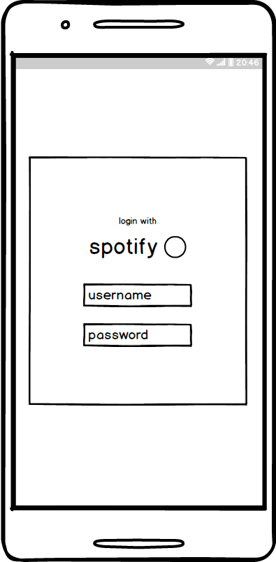
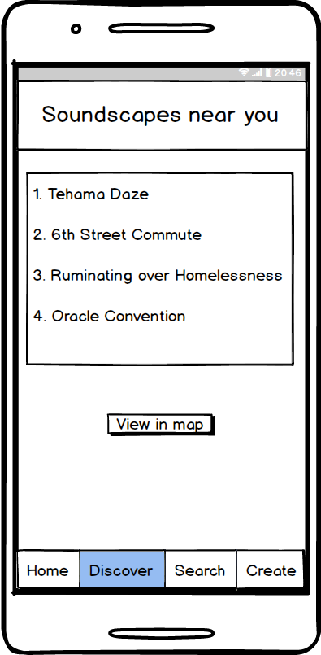
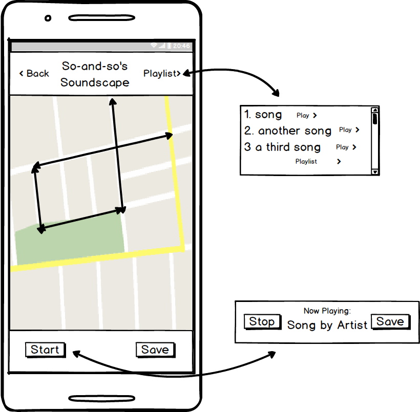
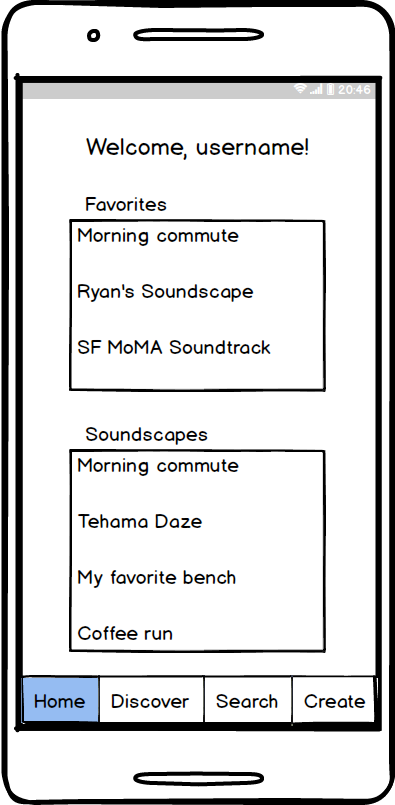

# SoundScapes

## Background and Overview

What does it do and why? Give example.

Add link to live: [Link]()

## Functionality & Minimum Viable Product

This app will, at a minimum, satisfy the following criteria with smooth, bug-free navigation:

- [ ] OAuth with spotify...
- [ ]

### Bonus

- [ ] cool features

## Design Documents

### Wireframes

# Login

# Homepage/Discovery

#SoundScape View

# User Profile

* [API Endpoints][api_endpoints]
* [React Components][component_hierarchy]
* [Sample Schema][sample_schema]
* [Sample State][sample_state]

## Group Members & Work Breakdown

Our group consists of four members: Ryan Mapa, Parker Fritch, David Banks, Michael Wei

Ryan's primary responsibilities will be:
* Timeline manager.
*
*
*

Parker's primary responsibilities will be:
*
*
*

David's primary responsibilities will be:
*
*
*

Michael's primary responsibilities will be:
*
*
*

## Technologies and Technical Challenges

Rails backend
OAuth
React Native
Spotify API
Google Maps API

This mobile Android application will be built using a Rails backend with a React Native frontend, integrating APIs from Google Maps and Spotify.
+ OAuth simultaneously connects us with the data we need, while eliminating requirements for local Auth
+ Pulling data from Google and Spotify lets us stitch together SoundScapes
+ React Native allows us to interact smoothly with native code if we need to
+ React Native's cross-platform functionality will be easily applicable to other mobie operating systems

The technical challenges for this application will be:

+ Pulling the relevant information from Spotify
  + Current song
  + Song changes
+ Google Maps Api
  + Port web app knowledge over to Android
  + Get current device location
  + Filter map by nearby SoundScapes
  + Draw Polylines from current location in Realtime
  + On song change, create a new SoundSpot at current location, and change Polyline color
  + Figure out how to save SoundScape information
+ React Native
  + Figure out differences from Reactjs
+ OAutn
  + How do we do it?

## Technology details of Our Stack

### Google Maps API
[Google Maps API](https://developers.google.com/maps/documentation/android-api/start)

+ Allows us to create maps with Google data

+ Libraries like Drawing and Places expand the functionality, allowing us to draw lines

### React Native
[react native](https://github.com/facebook/react-native)
+ React Native library lets you build mobile apps using Javascript and React, indistinguishable from apps built with Obj-C, Swift, or Java.

### Spotify API

[node.js](https://github.com/nodejs/node)
+ Provides data on the song a user is currently playing

### FEATURE Overview

Major rundown on core features (ex: chat) so like, the map view or something...

**How it works in SoundScapes**

In Woven, we are dealing with a single chatroom with two people.

On the **server side**, we have a simple Express.js application which does 2 things:

+ 1) a `GET '/'` request handler in the chatroom box, for the message board / Send button to create a new message.

+ 2) Websockets server for messages from websocket clients.

+ **Websockets**: an upgrade to typical HTTP requests - allows for bi-directional data transfer between the client and server.
[socket.io](https://socket.io/) seems to work the best.
(as opposed to HTTP unidirectional flow where the server must take on all the client requests before moving on)

On the **client side**, we have:

+ a page with 2 handlers
  + 1) on the Send button, which picks up the input message.
  + 2) one that listens for new messages on the websockets client, AKA listens for messages sent by the SO, to update the `current_user`'s' message board.

**Step by step** here’s what happens when `current_user` sends a message.:

+ 1) app notices the 'Send' button click through a JS event handler.
+ 2) emits a websocket message through the websocket client connected to the server.
+ 3) the partner receives the new message as a push message through a websocket component running in the SO's application.
+ 4) message is obtained, and chat is updated.

### API Endpoints with MongoDB

If we were using Rails, we would need to convert to and from JSON. With Node.js, we can simply deliver JSON objects through RESTful APIs for the client. With MongoDB, we don't have to worry about the conversion between JSON and Ruby. Also, we avoid the need for multiple data-type conversions by using a uniform data serialization format across the client, server, and database.

## Implementation Timeline

### Phase 1: Learn Technologies (2 days)

+ Objective: All group members will dedicate the weekend to learning each component of the MERN (MongoDB, Express, React Native, Node.js) stack and become familiar with the overall workflow.

+ By the end of Day 2, we will have:
  + Completed Proposal README
  + Understanding of MERN

### Phase 2: Backbone (3 days)

+ Phase 2a: User Authentication (All) (1 day):
  + Objective: Set up user authentication via React Native and Auth0 API.
  + By the end of the Day 3, we will have:
    + User can sign up and login that persist through sessions unless logged out.

+ Phase 2b: Splash (Janet) + Home/Index Page (Keith/Jared) (2 days):
  + Objective: Set up functional index page for the application, that allows for easy access to other features.
  + By the end of the day, we will have:
    + An index page that allows the user to navigate to the app's features.

+ Phase 2c User Profiles (Greg and Evelyn) (2 days):
  + Objective: Set up User Profiles
  + By the end of the day, we will have:
    + Users can access and edit their profile page.

### Phase 3: MVP Features  (4 days)

+ Phase 3a: Virtual Plant (4 days) (Janet and Keith)
  + Features include:
    + Plant attributes: name of plant, type of plant, age, description, health, happiness.
    + Functionality: water, sunlight.
    + Display: feature icon, background with time of day, water button, feeding button, image of plant at different stages, name, happiness level, health of plant.

+ Phase 3b: Instant Messaging w/ [socket.io](https://socket.io/) (4 days) (Evelyn, Greg, Jared)
  + Features include:
    + Stickers / Emoticons
    + Photos
    + Mood tracker / status
    + Database for message storage

## Plan for getting users and reviews

+ All members will each share with at least 20 friends and family members.
+ Soft launch with close friends.
+ Janet will post in an appropriate sub-reddit and Product Hunt for exposure.
+ Evelyn will submit the app for review on the App store.
